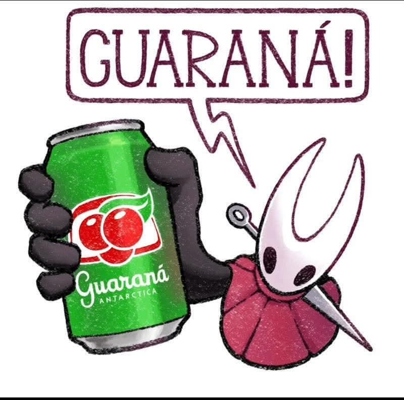

# Advergame Guaraná: O Grito da Energia

Bem-vindo ao Advergame Guaraná, um mini-jogo interativo criado para celebrar a energia do Guaraná Antarctica de uma forma divertida e única!

Este projeto foi desenvolvido como um protótipo de advergame onde os jogadores usam a sua própria voz para interagir com o jogo. A mecânica é simples: grite para encher a sua barra de energia e ganhe um Guaraná!

## 🎮 Como Jogar

1.  **Abra o jogo:** Clique no link do projeto.
2.  **Dê permissão:** O navegador irá pedir permissão para usar o seu microfone. Clique em "Permitir".
3.  **Comece o Desafio:** Clique em "COMEÇAR!".
4.  **GRITE!** Use a sua voz para encher a garrafa de energia no centro do ecrã. A barra esvazia-se lentamente, por isso mantenha a energia!
5.  **Vença:** Ao encher a barra completamente, você vence e é recompensado com uma surpresa especial e um QR Code.

## ✨ Funcionalidades

* **Controlo por Voz:** Utiliza a **Web Audio API** para capturar o volume do microfone em tempo real.
* **Gameplay Interativo:** Mecânica de encher a barra que exige um som contínuo e alto.
* **Design Temático:** Interface e cores inspiradas na identidade visual do Guaraná Antarctica.
* **Recompensa Final:** Um ecrã de vitória com som, arte personalizada e um QR Code de exemplo.

## 🛠️ Tecnologias Utilizadas

* **HTML5:** Estrutura base do jogo.
* **CSS3:** Estilização, animações e responsividade.
* **JavaScript (Puro):** Toda a lógica do jogo, manipulação do DOM e interatividade.
* **Web Audio API:** A tecnologia central para a análise de áudio do microfone.

## 🚀 Como Executar Localmente

Se quiser testar ou modificar o projeto no seu computador:

1.  Clone este repositório: `git clone https://github.com/SEU-NOME/NOME-DO-REPOSITORIO.git`
2.  Abra a pasta do projeto no seu editor de código (ex: VS Code).
3.  É **essencial** executar os ficheiros a partir de um servidor local devido às políticas de segurança do navegador para acesso ao microfone. Recomendamos a extensão **Live Server** para o VS Code.

## 🎨 Créditos

* **Ideia e Conceito:** Cristian Alves da Silva.
* **Arte da Vitória:** A arte da personagem Hornet (de *Hollow Knight*) foi encontrada na internet. O crédito total pela personagem e pelo seu design pertence aos seus incríveis criadores, a **Team Cherry**. Se você é o criador desta arte específica, por favor, entre em contato para que os devidos créditos sejam adicionados!
